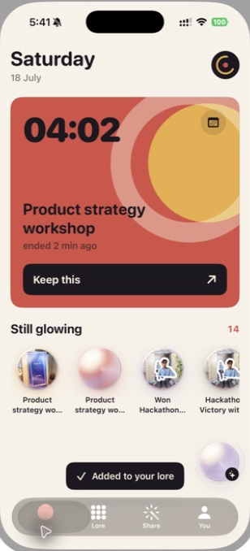
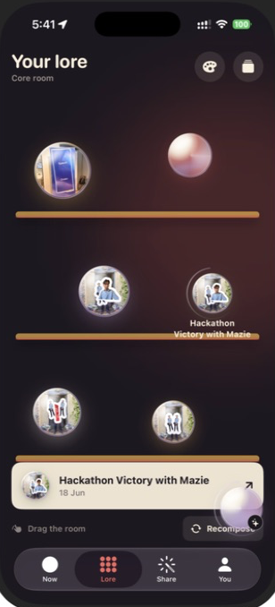

# Solora

> Your life becomes your lore.

Solora is a native iOS career-memory companion. It turns the moments that shape a career—conversations, decisions, events, ideas and wins—into a visual personal world that can be revisited, connected and shared when it matters.

## What it does

- **Capture memories in the moment.** Write a reflection, attach a photo, or annotate by voice. Solora turns the completed voice note into a structured, user-reviewed memory draft.
- **Make memories tangible.** Photos and foreground-cutout stickers become luminous glass bubbles, cached on device for responsive navigation.
- **Explore your lore.** Browse a living world in three visual modes: the Core Room, a Constellation map and a tactile Career Fridge. Open any bubble to read its story or remove it through a deliberate confirmation flow.
- **Keep a live pulse.** The Now screen surfaces a live event prompt and a device-time clock, making it easy to reflect while a moment is still fresh.
- **Bring in existing context.** A user-led ChatGPT memory-import flow provides a prompt, lets the user choose what to bring back, and keeps the final save under their control.
- **Connect Calendar thoughtfully.** Google Calendar uses read-only access to surface completed events for individual review; nothing becomes a memory until the user adds their own reflection.
- **Create useful outputs.** Select groups of memories to generate share-ready stories, social posts, a CV view, talking points and an in-app deck preview.
- **Talk to Solora.** The persistent companion supports voice conversation, navigates to app surfaces, and can open a requested memory through explicit local tools.

## Experience map

| Surface | Purpose |
| --- | --- |
| **Now** | Capture reflections, add photos or voice annotations, and revisit recent memories. |
| **Lore** | Explore memory bubbles spatially, change visual worlds and open full memory details. |
| **Share** | Combine selected memories into story, post, CV, talking-point and deck formats. |
| **You** | Manage personal preferences, CV context and connected Google Calendar access. |

## Visual system

Solora is built around warm paper surfaces, soft glass, luminous colour and responsive motion. The companion orb is a persistent visual anchor; memory bubbles can contain a photo and an optional foreground-cutout sticker. The three lore worlds preserve the same data while giving it different emotional contexts:

- **Core Room** — colourful, reflective and immersive.
- **Constellation** — a night-sky map of connected moments.
- **Career Fridge** — a tactile collection of magnets, notes and stickers.

## Screens

| Now | Lore |
| --- | --- |
|  |  |

## Architecture

```text
SwiftUI iOS app
├── Authentication      Google Sign-In and Firebase Authentication
├── Domain              memory, media, CV and persistence repositories
├── Assistant           Solora companion, Realtime session and local app tools
├── Calendar            OAuth consent, Calendar API client and review flow
├── Onboarding          personalisation and user-led memory import
├── Views / Design      app surfaces, glass bubbles, worlds and motion
└── Firebase
    ├── Authentication  account identity
    ├── Firestore       memories and CV context
    ├── Storage         photos and generated stickers
    └── Functions       short-lived Realtime credentials and voice-memory shaping
```

### On-device media cache

Memory photos and stickers are stored in `Library/Caches/SoloraMomentMedia` after first use and preloaded whenever the memory collection changes. A small in-memory cache keeps page switches instantaneous, while the disk cache is bounded so iOS can reclaim space when necessary.

### Privacy and control

- Every Calendar event is reviewed before it is saved as a memory.
- The ChatGPT import flow asks the user to paste results back into the app and select what belongs in their lore.
- Realtime credentials are minted server-side and are short lived; the app never embeds an OpenAI API key.
- Voice annotations are sent only after the user finishes recording and chooses to create a memory.
- Deleting a memory requires a separate confirmation sheet and a swipe-to-confirm action.

## Technology

| Area | Tools |
| --- | --- |
| iOS | Swift 6, SwiftUI, UIKit, PhotosUI, Speech and AVFoundation |
| Backend | Firebase Functions on Node.js 22 and TypeScript |
| Data | Firebase Authentication, Cloud Firestore and Firebase Storage |
| Identity and calendar | Google Sign-In and Google Calendar API |
| Voice companion | OpenAI Realtime over WebRTC, brokered through Firebase Functions |
| AI memory shaping | OpenAI Responses API, called only from Firebase Functions |
| Tooling | Xcode, Swift Package Manager, Firebase CLI and Node.js |

## Getting started

### Prerequisites

- Xcode with an iOS 17.0-or-newer deployment runtime
- A Google/Firebase project configured for the bundle identifier
- Node.js 22 and the Firebase CLI for backend work
- An OpenAI API key configured as a Firebase Functions secret for voice features

### Configure the iOS app

1. Place the Firebase iOS configuration file at `Solora/Resources/GoogleService-Info.plist`.
2. Ensure `GOOGLE_REVERSED_CLIENT_ID` in the Xcode build settings matches the reversed client ID in that configuration file.
3. In Google Cloud, enable the Google Calendar API and configure OAuth Data Access for `https://www.googleapis.com/auth/calendar.events.readonly`.
4. Open [Solora.xcodeproj](Solora.xcodeproj) in Xcode and allow Swift Package Manager to resolve packages.
5. Choose the `Solora` scheme and run on a simulator or a connected iPhone.

### Configure Firebase Functions

```bash
cd functions
npm install
npm run build
cd ..
firebase functions:secrets:set OPENAI_API_KEY
firebase deploy --only functions
```

The deployed functions authenticate callers with Firebase Authentication and issue short-lived Realtime client credentials. Keep API keys in Firebase Secrets only; do not add them to Xcode settings, source files or client-side configuration.

### Run checks

```bash
# iOS unit tests
xcodebuild test \
  -project Solora.xcodeproj \
  -scheme Solora \
  -destination 'platform=iOS Simulator,name=iPhone 16 Pro'

# Functions tests
npm --prefix functions test

# Firestore rules tests
npm --prefix firebase-tests test
```

## Repository guide

| Path | Contents |
| --- | --- |
| `Solora/App` | app entry point and composition root |
| `Solora/Assistant` | voice companion, Realtime transport and local navigation tools |
| `Solora/Authentication` | Google and Firebase sign-in state |
| `Solora/Calendar` | OAuth, Calendar client, candidates and review flow |
| `Solora/Design` | theme, motion, orb and glass presentation components |
| `Solora/Domain` | models plus Firebase, media and CV repositories |
| `Solora/Onboarding` | personalisation and user-controlled import flows |
| `Solora/Views` | Now, Lore, Share, You and supporting screens |
| `functions` | Firebase Functions source and tests |
| `firebase-tests` | Firebase security rules tests |
| `docs/screenshots` | product screenshots used in this README |

## Contributing

Read [AGENTS.md](AGENTS.md) before changing the project. It explains architecture boundaries, required checks, secret handling and the device-build coordination rules used by this repository.
